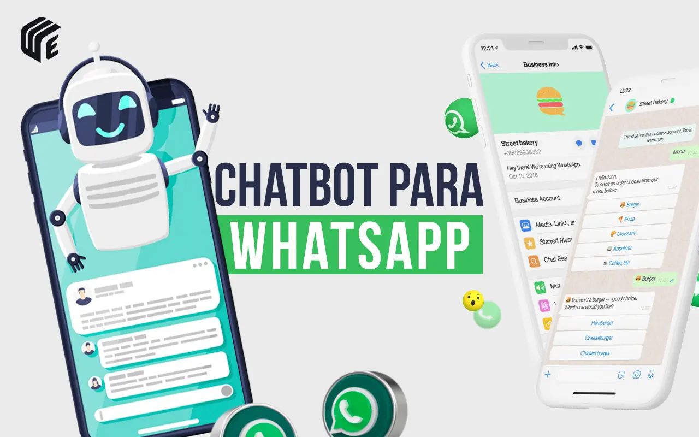

# 🤖 WhatsApp Bot - NetPonte

Este projeto é um **freelance** desenvolvido para a empresa **NetPonte**, provedor de internet fibra óptica.  
O bot automatiza o atendimento via WhatsApp, permitindo que clientes obtenham informações sobre a empresa, planos, segunda via de boleto e atendimento humano.

# 

---

## ✨ Funcionalidades

- ✅ Conexão automática com WhatsApp via QR Code.
- ✅ Resposta automática a mensagens de clientes.
- ✅ Menu principal com opções de interação.
- ✅ Simulação de digitação para tornar a interação mais natural.
- ✅ Respostas detalhadas para cada opção selecionada pelo cliente.

---

## 💬 Formas de Interação

O bot exibe o menu principal para o cliente:

Olá [Nome]! Sou o assistente virtual da NetPonte. Como posso ajudá-lo hoje? Por favor, digite uma das opções abaixo:
1 - Quem somos
2 - Conheça nossos planos
3 - 2 via de boleto
4 - Falar com atendente
5 - Outras perguntas

### 1️⃣ Quem somos
- Envia informações sobre a empresa, história e serviços.
- **Exemplo:** Cliente digita `1` → Bot responde com a descrição da NetPonte.

### 2️⃣ Conheça nossos planos
- Mostra os planos de internet fibra óptica disponíveis.
- **Exemplo:** Cliente digita `2` → Bot envia tabela de planos com detalhes.

### 3️⃣ Segunda via de boleto
- Solicita dados do cliente (nome completo + CPF ou número do cliente) e fornece instruções para acessar a 2ª via.
- **Exemplo:** Cliente digita `3` → Bot pede dados → Cliente envia → Bot retorna link ou instruções.

### 4️⃣ Falar com atendente
- Transfere o cliente para atendimento humano.
- **Exemplo:** Cliente digita `4` → Bot informa que um atendente entrará em contato.

### 5️⃣ Outras perguntas
- Oferece respostas rápidas ou direciona para outros canais de suporte.
- **Exemplo:** Cliente digita `5` → Bot lista FAQs ou instruções adicionais.

---

## 🛠 Tecnologias Utilizadas

- **Node.js**
- **whatsapp-web.js**
- **qrcode-terminal**

